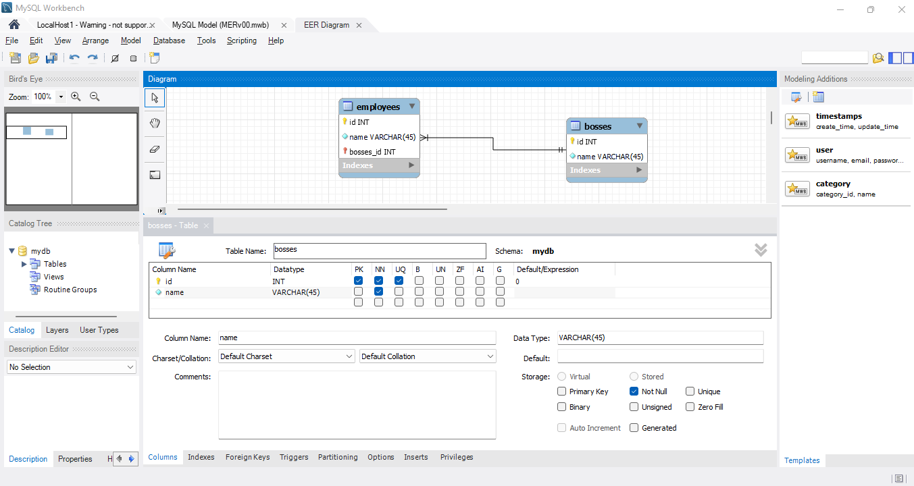

# Prueba técnica: Sistema de gestión de empleados

[Enunciado del problema](./docs/PruebaTecnicaMiddleFullStackDeveloper.pdf)

## Servidor backend

Servidor backend implementado con NodeJS/ExpressJS.

Modelo Entidad-Relación:
[CogenTech-server1](https://github.com/da8y01/cogentech-server1)

[MER (MySQL Workbench)](./docs/MERv00.mwb)
[Forward Enginnering SQL script](./docs/ForwardEnginneringv01.sql)

## Aplicación cliente

Aplicación frontend implementada con Angular framework.
[CogenTech-ng3](https://github.com/da8y01/cogentech-ng3)
